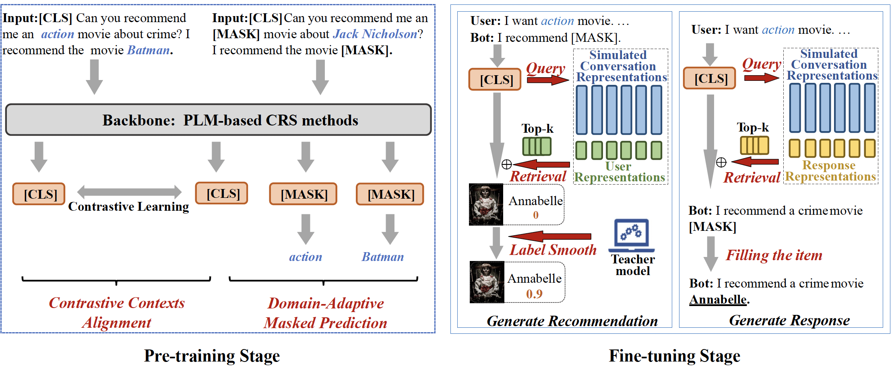

# LOT-CRS
This is the official PyTorch implementation for the paper:
> Zhipeng Zhao, Kun Zhou, Xiaolei Wang, Wayne Xin Zhao, Fan Pan, Zhao Cao, Ji-Rong Wen. Alleviating the Long-Tail Problem in Conversational Recommender Systems. RecSys 2023.

## Overview
Conversational recommender systems (CRS) aim to provide the recommendation service via natural language conversations. To
develop an effective CRS, high-quality CRS datasets are very crucial. However, existing CRS datasets suffer from the long-tail issue, i.e.,
a large proportion of items are rarely (or even never) mentioned in the conversations, which are called long-tail items. As a result,
the CRSs trained on these datasets tend to recommend frequent items, and the diversity of the recommended items would be largely
reduced, making users easier to get bored.

To address this issue, this paper presents **LOT-CRS**, a novel framework that focuses on simulating and utilizing a balanced CRS
dataset (i.e., covering all the items evenly) for improving LOng-Tail recommendation performance of CRSs. In our approach, we design
two pre-training tasks to enhance the understanding of simulated conversation for long-tail items, and adopt retrieval-augmented
fine-tuning with label smoothness strategy to further improve the recommendation of long-tail items. Extensive experiments on two
public CRS datasets have demonstrated the effectiveness and extensibility of our approach, especially on long-tail recommendation.


## Environment Configuration
### Build Docker Image
```bash
$ docker build -f Dockerfile -t LOT-CRS .
```
### Create Docker Container
```bash
$ docker run --name=LOT-CRS --gpus all -it -v <your_path_to_folder>:/Privacy-in-Code-Models LOT-CRS:latest
```

### Settings
```bash
$ accelerate config # set your accelerate config for training
$ wandb login # login to track training process
```